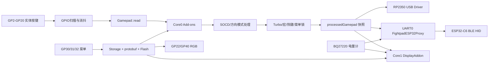

# GP2040-Fix / Fightpad12Slim 项目吃透指南

> 目标：看完本文后，能够回答“按键从哪里进来、经过什么处理、最后从 USB 或蓝牙发到哪里”，并能快速定位菜单、OLED、RGB、电池、配置和 ESP32-C6 协作代码。

## 0. 本文对应的代码基线

本文按 **2026-08-27 当前工作树**审计，不是只按 Git 最后一次提交写的。

- 当前分支：`FIGHTPAD_FIX`
- 当前提交：`bb4fb7fede3b110d62b7c79f3da3e5b6a03cc2ce`
- 提交说明：`V1.1 add long press 5s x+y+turbo进入bootsel`
- 当前仍有未提交修改：
  - `headers/addons/scrollwheel_menu.h`
  - `src/addons/display.cpp`
  - `src/addons/scrollwheel_menu.cpp`
  - `src/display/ui/screens/ButtonLayoutScreen.cpp`
- 当前 `origin` 指向 `https://github.com/jiang-dongwei/myblog.git`，它不像 GP2040-CE 官方仓库地址。以后同步或推送前要先执行 `git remote -v`，确认不会推错仓库。

因此，本文记录的菜单顺序、USB/BT 显示和 Custom Theme 条件显示，包含上述未提交代码。后续代码变化时，应以源码为准。

---

## 1. 先用一句话理解项目

这是一个基于 GP2040-CE 的 RP2350B 格斗控制器固件：

1. RP2350B 扫描实体按键并做消抖、SOCD、Turbo、宏和热键处理；
2. USB 档由 RP2350B 自己向主机发送 USB HID 报告；
3. 蓝牙档由 RP2350B 通过 UART 把按键报告交给 ESP32-C6，再由 C6 发 BLE HID；
4. RP2350B 同时负责 OLED 菜单、双路 RGB、电量计和配置持久化。

最重要的边界是：**这个仓库主要实现 RP2350B 一侧，ESP32-C6 的 BLE 协议栈和广播连接逻辑在另一个工程中。**

---

## 2. 项目全景图



必须牢记三条数据边界：

- `gamepad` 是 Core0 正在加工的可变状态；
- `processedGamepad` 是加工完成后给 Core1、OLED 和 UART 消费的快照；
- Flash 保存只能在 Core0 执行，Core1 不能直接写配置。

---

## 3. 目录怎么读

| 路径 | 作用 | 建议优先级 |
|---|---|---:|
| `src/main.cpp` | 双核入口 | 1 |
| `src/gp2040.cpp` | Core0 初始化、主输入循环、USB/BT 路由 | 1 |
| `src/gp2040aux.cpp` | Core1 初始化与循环 | 1 |
| `src/gamepad.cpp` | GPIO 状态转游戏按键、SOCD 和方向模式 | 1 |
| `src/addonmanager.cpp` | Add-on 生命周期和执行顺序 | 1 |
| `configs/Fightpad12Slim/BoardConfig.h` | 本机型引脚、功能开关和硬件参数 | 1 |
| `src/addons/scrollwheel_menu.cpp` | 拨轮菜单、输入锁、休眠活动时间 | 2 |
| `src/addons/fightpad_esp32_proxy.cpp` | RP2350 与 ESP32-C6 的 UART 协议 | 2 |
| `src/addons/fightpad_ambient_leds.cpp` | GP22/GP40 RGB 和 GP24 电源控制 | 2 |
| `src/addons/fightpad_bq27220.cpp` | 电量计初始化、轮询和快照 | 2 |
| `src/addons/display.cpp` | OLED 页面调度、菜单和状态弹窗 | 2 |
| `src/display/ui/screens/` | 每个 OLED 页面具体绘制 | 2 |
| `src/drivermanager.cpp` | InputMode 到 USB 驱动的映射 | 2 |
| `src/storagemanager.cpp`、`src/config_utils.cpp` | 配置加载、保存和 CRC | 2 |
| `proto/config.proto` | 配置数据结构的源定义 | 3 |
| `src/webconfig.cpp`、`www/` | Web Config 后端接口与前端 | 3 |
| `src/drivers/` | XInput、PS、Switch、通用 HID 等协议实现 | 3 |
| `docs/` | 专题协议、架构和交接文档 | 查专题时读 |

不要一上来逐文件通读 `src/drivers/`。先把 Core0 一帧输入怎样流动吃透，再读某一种 USB 协议，效率最高。

---

## 4. 从上电开始追踪

### 4.1 `main()` 如何启动双核

入口在 `src/main.cpp`：

1. 创建 `GP2040`，作为 Core0 主对象；
2. 创建 `GP2040Aux`，作为 Core1 辅助对象；
3. 先执行 `GP2040::setup()`；
4. 再通过 `multicore_launch_core1(core1)` 启动 Core1；
5. Core0 等待 `GP2040Aux::ready()`；
6. Core1 和 Core0 分别进入自己的无限循环。

之所以必须先完成 Core0 setup，是因为 Core1 要使用已经创建好的 Driver、Storage 和 `processedGamepad`。

### 4.2 Core0 setup 的关键顺序

入口：`src/gp2040.cpp` 的 `GP2040::setup()`。

按实际代码顺序：

1. 读取 watchdog scratch RAM 中的软件启动模式；
2. 如果请求 BOOTSEL，立即调用 `reset_usb_boot(0, 0)`；
3. 初始化 Storage，从 Flash 读取配置；
4. 初始化 USB、SPI、I2C；
5. 创建 `gamepad` 和 `processedGamepad`；
6. 根据当前 profile 建立 GPIO 功能映射；
7. 初始化普通按键 GPIO 和 GP33 传输开关；
8. 加载 Core0 Add-ons；
9. 判断上电按键和请求的启动模式；
10. 选择并初始化 USB Driver；
11. 注册保存和重启事件。

BOOTSEL 检查放在最前面是本分支的关键修复：RGB Add-on 和电源轨尚未初始化就跳进 ROM 下载模式，可避免进入 BOOTSEL 瞬间 LED 闪一下。

### 4.3 上电按键

`GP2040::getBootAction()` 会在上电初始化期间读取按键：

- `S1 + S2 + ↑`：进入 BOOTSEL；
- `S2`：进入 Web Config，除非配置禁止；
- 其他模式键：按配置选择对应 InputMode。

这里指的是**固件上电检查时按键已经处于按下状态**，不是开机后任意时刻按一下。

---

## 5. Core0 的一帧到底做了什么

入口：`GP2040::run()`。

正常游戏模式的一次循环顺序如下：

```text
检查 profile 是否变化
  -> 读取 GPIO 并消抖
  -> Gamepad::read() 把引脚位图映射成按键状态
  -> 发布 raw state 事件
  -> 处理 USB Host
  -> Add-ons preprocess()
  -> Gamepad::process()：方向反转、4-way、SOCD、D-pad/摇杆模式
  -> Add-ons process()
  -> 菜单未锁定时处理普通热键和重启热键
  -> 发布 processed state 事件
  -> 复制到 processedGamepad
  -> 根据 GP33 决定 USB/BT 输出
  -> tud_task()
  -> 更新 USB attach/detach
  -> Add-ons postprocess()
  -> 在 Core0 末尾执行待处理的保存或重启
```

### 5.1 `Gamepad::read()` 与 `Gamepad::process()` 不一样

`Gamepad::read()` 做的是“翻译”：

- 输入：`debouncedGpio` 位图；
- 查当前 profile 的 pin mapping；
- 输出：`state.dpad`、`state.buttons`、摇杆中点等基础状态。

`Gamepad::process()` 做的是“规则加工”：

- X/Y 方向反转；
- 四方向限制；
- SOCD 清理；
- 把方向键转为左摇杆或右摇杆值。

所以排查问题时要先判断：

- 引脚根本没读到：查 BoardConfig、profile、GPIO 和消抖；
- 读到了但结果不对：查 Add-on、SOCD、Turbo、宏和热键；
- 内部结果正确但主机没收到：查 Driver、传输档位和 USB/BLE 输出。

### 5.2 Web Config 模式是一条特殊支路

配置模式使用 `NetDriver`，会跳过 Core0 正常 Add-on 处理链。它仍会更新 `processedGamepad`，让 Core1 的按键预览能显示输入，然后处理网络配置、重启热键和保存请求。

这意味着：某个 Add-on 在正常游戏模式生效，不代表它在 Web Config 模式也会生效。

---

## 6. Add-on 机制和执行顺序

`AddonManager::LoadAddon()` 的逻辑很简单：

1. 调用 `available()`；
2. 可用则调用 `setup()` 并按加载顺序存入列表；
3. 不可用则直接释放对象；
4. 每一帧按相同顺序调用 `preprocess()`、`process()` 和 `postprocess()`。

因此 **Add-on 顺序就是行为优先级的一部分**。后面的 Add-on 能看到甚至覆盖前面处理过的状态。

### 6.1 Core0 Add-ons

Core0 主要是输入和通信：

- USB 键盘/手柄 Host；
- 模拟输入、磁轴、方向和 SOCD 扩展；
- Wii、SNES、PCF8575、TG16 等外设；
- `FightpadESP32ProxyAddon`；
- `ScrollWheelMenuAddon`；
- `FightpadAmbientLEDAddon`；
- 最后是 Reverse、Turbo、InputMacro 等输入覆盖模块。

Turbo 和宏放在靠后位置，是因为它们需要修改前面已经形成的按钮状态。

### 6.2 Core1 Add-ons

Core1 主要负责相对独立或较慢的外设：

- `DisplayAddon`；
- `FightpadBQ27220BatteryAddon`；
- NeoPixel/玩家灯/板载灯；
- 蜂鸣器、震动和 Reactive LED；
- USB Driver 的 `processAux()`。

Core1 不负责最终 USB 输入报告，也不应该直接写 Flash。

---

## 7. Fightpad12Slim 引脚总表

### 7.1 游戏按键：GP2～GP20

按键均按 active-low 使用，内部消抖后转换为“按下为 1”的位图。

| GPIO | GP2040 名称 | 常见 XInput 含义 |
|---:|---|---|
| 2 | Up | Up |
| 3 | Down | Down |
| 4 | Left | Left |
| 5 | Right | Right |
| 6 | B1 | A |
| 7 | B2 | B |
| 8 | B3 | X |
| 9 | B4 | Y |
| 10 | L1 | LB |
| 11 | L2 | LT |
| 12 | R1 | RB |
| 13 | R2 | RT |
| 14 | L3 | LS |
| 15 | R3 | RS |
| 16 | S1 | Back |
| 17 | S2 | Start |
| 18 | A1 | Guide |
| 19 | A2 | Capture/菜单 Back |
| 20 | Turbo | Turbo |

所以本机型中的 X、Y、Turbo 对应：

- X：B3 / GP8；
- Y：B4 / GP9；
- Turbo：GP20。

### 7.2 其他硬件

| GPIO | 用途 |
|---:|---|
| 0/1 | OLED I2C0 SDA/SCL |
| 21 | VBUS 状态输入，用于电池状态帧 |
| 22 | 12 颗按键 WS2812 灯链 |
| 23 | 板载状态灯/传输诊断 |
| 24 | RGB 5V Boost 使能 |
| 25/26/27 | BQ27220 软件 I2C SCL/SDA/GPOUT |
| 28/29 | PIO-USB Host D+/D- |
| 30 | 拨轮按键：短按灯效开关、长按菜单 |
| 31/32 | 拨轮两个方向输入 |
| 33 | USB/BT 传输档位，低=USB，高=BT |
| 34 | ESP32-C6 EN，高有效并跟随 BT 档 |
| 35 | 当前未启用的 C6 控制预留 |
| 40 | 19 颗底部/环境 WS2812 灯链 |
| 41 | VBAT ADC 诊断 |
| 42/43 | 电池日志 UART1 TX/RX |
| 44/45 | RP2350 ↔ ESP32-C6 UART0 TX/RX |
| 46/47 | 当前保留 |

这些非普通按键引脚在 BoardConfig 中标为 `ASSIGNED_TO_ADDON`，目的是防止通用 GPIO 扫描器把它们误认成按键。它们应由各自 Add-on 独占管理。

---

## 8. USB 与蓝牙不是两个独立输入源

GP33 是唯一传输选择依据：

| GP33 | 模式 | GP34/C6 | RP2350 USB HID | 输入去向 |
|---:|---|---|---|---|
| 0 | USB | 关闭 | 连接 | RP2350 USB Driver |
| 1 | BT | 开启 | 普通游戏模式下断开 | UART → ESP32-C6 → BLE |

切换有 30 ms 非阻塞消抖。

### 8.1 USB 档

- RP2350 Driver 根据当前 `InputMode` 生成 HID 报告；
- 支持 XInput、PS3、PS4、PS5、Switch、Switch Pro、Keyboard、Generic HID 等；
- Fightpad12Slim 对主机统一显示 USB 产品名 `FIGHTPADSLIM`；
- VID/PID 和各模式描述符仍由相应驱动决定。

### 8.2 蓝牙档

- RP2350 不直接实现 BLE；
- `FightpadESP32ProxyAddon` 每约 10 ms 发送一次 `FP` 输入帧，也会在状态变化时发送；
- C6 根据已选择的 BLE Profile 生成 Xbox、Standard Gamepad、PlayStation 或 Switch BLE 控制器；
- RP2350 普通 USB HID 会先尝试发中立报告，再断开 USB 设备，避免一套按键同时控制 USB 和蓝牙两端；
- Web Config 和 BOOTSEL 是特殊模式，不受普通蓝牙档断开逻辑破坏。

### 8.3 为什么菜单中都叫 `Controller Mode`

USB 和 BT 的一级菜单都显示同一个名称，但进入的列表不同：

- USB 档进入有线 `InputMode` 列表；
- BT 档进入 BLE Profile 列表；
- 菜单打开时切换 GP33，会立即刷新；
- 如果当前子菜单已经不属于新档位，会退回主菜单。

---

## 9. RP2350 ↔ ESP32-C6 UART 协议

物理链路：UART0，115200 8N1，RP2350 GP44 TX / GP45 RX。

普通二进制帧固定 8 字节：

```text
Byte0 = 0x46 ('F')
Byte1 = 帧类型
Byte2..6 = 载荷
Byte7 = Byte0..6 的 XOR
```

| 名称 | Byte1 | 方向 | 作用 |
|---|---:|---|---|
| `FP` | `0x50` | RP → C6 | 按键、方向、摇杆和菜单锁 |
| `FT` | `0x54` | RP → C6 | USB/BT 当前档位 |
| `FB` | `0x42` | RP → C6 | 电量、VBUS 和 ADC 诊断 |
| `FM` | `0x4D` | RP → C6 | 请求切换 BLE Profile |
| `FI` | `0x49` | C6 → RP | C6 固件信息，多帧拼接 |
| `FS` | `0x53` | C6 → RP | Disconnected/Connecting/Connected/Pairing |
| `FA` | `0x41` | C6 → RP | BLE Profile ACK |

`FP` 的 Byte4 低位放 D-pad，bit7 是 gameplay lock。菜单打开时这个标志要求 C6 也输出中立 BLE 报告，防止只锁住 USB、却仍通过蓝牙把菜单操作当作游戏输入。

接收端包含帧头重新同步、超时、XOR 校验和多帧固件信息重组。跨核读取 Bluetooth 状态和固件信息时使用快照/临界区，而不是让 Core1 直接读取正在更新的缓冲区。

更详细的字节定义见：

- `docs/rp2350_input_report_protocol_esp32.md`
- `docs/menu_gameplay_lock_protocol_rp2350_esp32.md`
- `docs/fw_info_protocol_rp2350.md`
- `docs/bluetooth_status_protocol_rp2350.md`
- `docs/ESP32C6_BLE_PROFILE_HANDOFF.md`
- `docs/ESP32C6_SWITCH_BLE_PROFILE_RP2350_HANDOFF.md`

---

## 10. 拨轮菜单的真实状态机

实现：`src/addons/scrollwheel_menu.cpp` 和 `headers/addons/scrollwheel_menu.h`。

### 10.1 按键行为

- GP30 短按，菜单关闭时：切换普通灯效开关并持久化；
- GP30 短按，菜单打开时：确认当前项；
- GP30 长按 2 秒：进入或退出菜单；
- GP31/GP32：上下移动；
- GP19：返回上一级；
- 菜单输入滤波约 30 ms，旋转导航间隔约 80 ms。

注意：BoardConfig 中关于 GP30/31/32 的旧注释仍带有 ambient control/DIP switch 字样，但当前真实行为已经由拨轮菜单状态机接管。

### 10.2 当前一级菜单

USB 与 BT 的显示顺序相同：

```text
Lighting
Controller Mode
[Battery Details]   目前由板级宏关闭，所以默认不显示
Device Info
Bluetooth Info
```

区别只在 `Controller Mode` 的下一层。

### 10.3 Lighting 菜单

```text
Button Flash
Lighting Effect
[Custom Theme]      仅 Web Config 已启用 hasCustomTheme 时出现
Brightness
Turn Lights Off/On
```

`Lighting Effect` 当前有：

- Static Color；
- Gradient；
- Breathing；
- Rainbow；
- Chase。

Brightness 有 High、Medium、Low 三档。`Turn Lights Off` 是持久化总开关，不会清除当前效果、颜色、Button Flash、亮度或 GP30 普通灯效状态，再次打开后恢复原设置。

### 10.4 菜单期间为什么要锁游戏输入

菜单会经历三种锁状态：

```text
UNLOCKED -> CAPTURED -> DRAIN_UNTIL_RELEASE -> UNLOCKED
```

- 菜单打开立即进入 `CAPTURED`；
- USB Driver 临时收到中立状态；
- Turbo、宏和重启热键副作用被抑制；
- 蓝牙 `FP` 帧 bit7 同步通知 C6；
- 退出菜单后，不会立刻解锁；
- 必须确认 GP2～GP20 的原始值和消抖值都已释放，并稳定 30 ms，才重新允许游戏输入。

这样可以避免用 GP19 返回菜单时，游戏里同时触发 Capture/A2，也避免退出瞬间把仍按住的按钮“漏”给主机。

### 10.5 菜单不是页面栈

`navBack()` 是按 `SWMenuLevel` 手写的状态转换，不是通用的 push/pop 页面栈。新增层级时必须同时检查：

- `currentItems()`；
- `currentItemCount()`；
- `navSelect()`；
- `navBack()`；
- `clampScrollOffset()`；
- `DisplayAddon` 对应渲染分支。

只加菜单文本而漏掉其中一个位置，常见结果是索引越界、返回错层或 OLED 显示和实际动作不一致。

---

## 11. OLED 页面与显示优先级

`DisplayAddon` 在 Core1，普通页面实现位于 `src/display/ui/screens/`。

### 11.1 普通页面

开机先显示 3 秒 Fightpad Logo，然后进入按钮页面。按钮页面会显示：

- 按键布局和输入历史；
- 顶部偏左的 `USB` 或 `BT`；
- 当前传输实际使用的控制器类型；
- 电池格图标和百分比。

USB 档的类型来自 RP2350 `InputMode`；BT 档优先显示 C6 ACK 确认过的 BLE Profile，避免把“已保存但 C6 尚未切换成功”的目标值冒充成当前值。

### 11.2 覆盖优先级

显示并不是简单地永远画 BUTTONS 页面。当前优先级可概括为：

1. 启动画面保护；
2. BLE Profile 保存/同步提示；
3. Bluetooth 状态临时弹窗；
4. 拨轮菜单接管；
5. 普通 GPScreen 页面。

Pairing/Connecting/Connected/Disconnected 的新状态事件会唤醒 OLED。相同状态重复上报会被去重，避免不断刷新时间戳和动画。

### 11.3 省电规则

- USB 档：不因空闲关闭 OLED，也绕过普通屏保；
- BT 档：60 秒无活动后 OLED 和 RGB 一起关闭；
- 唤醒源：GP2～GP20 任意游戏按键、GP30～GP32、传输切换和新的 Bluetooth 状态；
- 唤醒只恢复显示和原灯效，不改持久化配置。

统一判断入口是 `isFightpadBluetoothIdleSleepExpired()`。它先确认当前确实为 BT 档，USB 档直接返回 false。

---

## 12. RGB：两条灯链只有一个最终所有者

Fightpad 定制 RGB 的最终输出所有者是 Core0 的 `FightpadAmbientLEDAddon`：

- GP22：12 颗按键灯；
- GP40：19 颗底部/环境灯；
- GP24：两条灯链的 5V Boost 使能。

虽然上游还有 `NeoPicoLEDAddon`，但 Fightpad 板级宏明确让定制 Add-on 接管 GP22，避免两个模块同时写同一灯链。

### 12.1 正常效果

两条灯链共享当前效果、颜色、亮度和动画相位，包含 Static、Gradient、Breathing、Rainbow、Chase。按键灯还可叠加 Button Flash。

Custom Theme：

- GP22 固定使用 12 颗按钮的 Normal/Pressed 颜色；
- GP40 把 12 色环形插值到 19 颗环境灯；
- Web Config 未启用时菜单不显示该选项。

### 12.2 最终优先级

从“必须熄灭”到“普通效果”，可按以下顺序理解：

1. BT 空闲休眠：全黑并关闭 GP24；
2. 有效 SOC ≤ 7%：全黑并关闭 GP24；
3. 重启/BOOTSEL blackout：全黑并关闭 GP24；
4. `Turn Lights Off` 总开关：全黑并关闭 GP24；
5. Bluetooth 临时状态灯：Pairing/Connecting Chase、Connected 蓝色、Disconnected 黑；
6. 普通 Lighting Effect 和 Button Flash。

GP30 短按开关只控制普通效果；Bluetooth 临时反馈在总开关允许时仍可显示。`Turn Lights Off` 则是更高优先级的总开关，Bluetooth 状态也不能越权点亮。

排查“灯为什么不亮”时，不要只看当前 effect，要从上面的高优先级门控逐项排查。

---

## 13. BQ27220 电池路径

实现：Core1 的 `FightpadBQ27220BatteryAddon`。

板级参数：

- GP25 SCL、GP26 SDA、GP27 GPOUT；
- 软件 I2C；
- 上电等待 2 秒；
- 每 2 秒轮询；
- 设计容量 650 mAh；
- 10 mΩ 采样电阻；
- 低电灯光阈值 7%；
- UART1 GP42/43 输出诊断，115200；
- `FIGHTPAD12SLIM_BQ27220_CURRENT_CALIBRATED` 当前仍为 0。

数据消费者：

```text
BQ27220
  -> Core1 电池快照
  -> OLED 电池图标/百分比
  -> Core0 ESP32 Proxy 的 FB 帧
  -> RGB 低电强制熄灭判断
  -> UART1 周期诊断日志
```

主菜单中的 `Battery Details` 当前由 `SCROLLWHEEL_BATTERY_INFO_MENU_ENABLED 0` 隐藏，但四页诊断实现仍保留，改成 1 可恢复入口。

电池代码中“静态检查完成”不等于“电量算法已经实机校准完成”。当前项目记录仍把 318 mA 校准、完整放电、满充识别和若干边界回归列为待实机确认。

---

## 14. 配置为什么能跨重启保存

配置的源结构在 `proto/config.proto`，运行时由 `Storage` 持有。

启动读取：

```text
Storage::init()
  -> 获取 Flash 容量
  -> EEPROM.start()
  -> ConfigUtils::load(config)
```

保存路径：

```text
菜单或 Web Config 修改 Storage 中的字段
  -> 触发 GP_EVENT_STORAGE_SAVE
  -> Core0 设置待保存标志
  -> GP2040::checkSaveRebootState()
  -> Storage::save()
  -> ConfigUtils::save()
  -> nanopb 编码 + CRC footer
  -> EEPROM.commit()
```

关键规则：

- `ConfigUtils::save()` 明确断言只能运行在 Core0；
- 写入前会设置 protobuf 的 `has_` 标志；
- 如果新 footer 与旧 footer 相同，说明数据没变化，会跳过实际 Flash 擦写；
- 某些 PS4/PS5 USB Host 认证场景可能拒绝普通保存，需要理解 `Storage::save(force)` 的条件；
- BLE Profile 使用更严格的“先强制保存成功，再允许发 Mode 命令”的流程，保存失败会回滚 RAM 值。

如果新增一个持久化设置，通常至少要检查：

1. `proto/config.proto` 字段；
2. `ConfigUtils` 默认值；
3. 旧配置迁移；
4. Web Config 读写；
5. 菜单写入；
6. Core0 保存事件；
7. 重启后读取和实机验证。

---

## 15. BOOTSEL 和重启路径

### 15.1 两种进入 BOOTSEL 的方式

- 上电时按住 `S1 + S2 + ↑`；
- USB 游戏模式中长按 `X + Y + Turbo` 5 秒。

第二种对应 GP8 + GP9 + GP20。它只应在 USB 档、非 Web Config 状态下触发，避免蓝牙操作误进入下载盘。

### 15.2 为什么要先 watchdog 重启

长按热键触发后不会在当前灯光已工作的上下文中直接跳 ROM，而是：

1. 设置 `g_scrollWheelRebootBlackout`；
2. 请求 `System::BootMode::USB`；
3. watchdog 重启；
4. 新一次 `GP2040::setup()` 最先读取 scratch RAM；
5. 在初始化 RGB 之前进入 `reset_usb_boot()`。

这就是避免 BOOTSEL 瞬间 LED 闪烁的核心设计。

### 15.3 BOOTSEL 盘的含义

BOOTSEL 是 RP2350 ROM 暴露的临时 USB 大容量存储接口，不是项目源码目录。复制 UF2 会触发烧录并重启；普通杂项文件通常不会成为固件内容，但不应把它当普通 U 盘使用。设备正常重启后会退出 BOOTSEL。

---

## 16. 构建配置和产物

### 16.1 当前目标

`CMakeLists.txt` 和 VS Code 配置对应：

- `PICO_BOARD=fightpad12slim`
- `PICO_PLATFORM=rp2350-arm-s`
- `GP2040_BOARDCONFIG=Fightpad12Slim`
- Pico SDK 2.2.0
- Ninja
- VS Code 构建目录：`build-ce-no-picotool`
- `SKIP_WEBBUILD=ON`

`SKIP_WEBBUILD=ON` 表示构建时不重新运行 Web 前端 npm 流程，而是使用仓库已有/已生成的 Web 资源。改了 `www/` 前端后若仍保持该选项，必须确认生成资源是否已经同步，否则 UF2 里可能还是旧页面。

### 16.2 VS Code 任务链

`.vscode/tasks.json` 的预期顺序：

```text
Configure Project
  -> Prepare Pico Tools
  -> Compile Project
```

其中 Prepare Pico Tools 会把可用的 `pioasm.exe` 复制到构建树需要的位置，用于绕开先前本机构建出的 pioasm 异常。

当前配置中 Pico SDK 路径是：

```text
E:\ComporyProject\pico-sdk-2.2.0
```

如果换电脑或移动目录，要优先检查：

- `.vscode/tasks.json`；
- `.vscode/settings.json`；
- 构建目录中的 `CMakeCache.txt`；
- `PICO_SDK_PATH`；
- CMake、Ninja、ARM Toolchain、pioasm、picotool 路径。

### 16.3 UF2 名称

CMake 产物规则是：

```text
GP2040-CE_<版本>_Fightpad12Slim.uf2
```

当前缓存版本曾显示为 `0.0.0`，因此实际文件可能是：

```text
build-ce-no-picotool/GP2040-CE_0.0.0_Fightpad12Slim.uf2
```

看到 `ninja: no work to do` 只代表 Ninja 认为目标无需重建，不自动证明 UF2 仍存在。应直接检查 UF2 文件、修改时间和大小。

---

## 17. 最实用的故障定位法

### 17.1 某个按键不工作

按顺序检查：

1. `BoardConfig.h` 中 GPIO 是否正确；
2. 是否被 profile 改写；
3. 是否误标为 `ASSIGNED_TO_ADDON`；
4. `debouncedGpio` 是否出现按下位；
5. `Gamepad::read()` 后 `state` 是否正确；
6. Turbo、宏、SOCD 或菜单锁是否覆盖；
7. `processedGamepad` 是否正确；
8. USB Driver 或 `FP` 帧是否正确。

### 17.2 USB 有输入，蓝牙没输入

重点检查：

- GP33 是否稳定为高；
- GP34 是否真的拉高并启动 C6；
- UART0 GP44/45 是否接反；
- `FT` 是否报告 BT；
- `FP` 是否每约 10 ms 发送；
- `FA` Profile ACK 是否收到；
- C6 是否有已绑定设备或处于 Pairing；
- 菜单锁 bit7 是否一直没有释放。

### 17.3 蓝牙有输入但 USB 主机也看到设备

检查 `processFightpadUsbTransportReport()` 和 USB attach/detach 状态机。不要只发送中立报告，BT 档设计目标是普通游戏 USB 设备软件断开。

### 17.4 OLED 不显示或不唤醒

检查：

- I2C0 GP0/1；
- 当前是否为 BT 档且已经空闲 60 秒；
- `g_scrollWheelLastActivityMs` 是否被按键或事件刷新；
- Splash、Bluetooth 弹窗、Profile 提示和菜单的覆盖优先级；
- Core1 是否已 ready。

### 17.5 RGB 不亮

按优先级检查：

1. BT idle sleep；
2. SOC 是否有效且 ≤ 7%；
3. reboot blackout；
4. `allLightsEnabled`；
5. GP30 普通灯效开关；
6. 当前 effect 和颜色是否为 Off；
7. GP24 Boost 是否拉高；
8. GP22/GP40 PIO 和灯数是否正确；
9. 是否有两个 Add-on 争抢同一 GPIO。

### 17.6 菜单操作导致游戏误按

检查三件事必须同时成立：

- 本地 `isScrollWheelGameplayInputLocked()`；
- USB 中立报告门控；
- UART `FP` Byte4 bit7 和 C6 端对应实现。

只修 RP2350 或只修 C6 都不完整。

---

## 18. 修改功能时应该从哪里下手

| 想改什么 | 首先看 | 还必须联查 |
|---|---|---|
| 改按键引脚/默认映射 | `configs/Fightpad12Slim/BoardConfig.h` | profile、OLED 布局、LED 索引 |
| 改输入处理顺序 | `src/gp2040.cpp` | Add-on 加载顺序、热键、Driver |
| 新增 USB 模式 | `src/drivermanager.cpp`、`src/drivers/` | enum、描述符、菜单、Web Config |
| 改 USB/BT 切换 | `src/gp2040.cpp`、`fightpad_esp32_proxy.cpp` | GP33 消抖、GP34、USB detach、OLED |
| 改 BLE Profile | `scrollwheel_menu.cpp`、`fightpad_esp32_proxy.cpp` | protobuf、Flash、ACK、C6 工程 |
| 改菜单 | `scrollwheel_menu.h/.cpp` | `display.cpp`、保存、输入锁、返回路径 |
| 改 BUTTONS 页面 | `ButtonLayoutScreen.cpp` | Core1 快照、当前传输/Profile ACK |
| 改 RGB | `fightpad_ambient_leds.cpp` | GP24、电量、休眠、总开关、Bluetooth 状态 |
| 改电池 | `fightpad_bq27220.cpp` | OLED、FB 帧、低电 RGB、实机校准 |
| 改持久化设置 | `proto/config.proto` | 默认值、迁移、Web Config、Core0 save |
| 改 Web Config | `www/`、`src/webconfig.cpp` | 生成资源、`SKIP_WEBBUILD` |
| 改 BOOTSEL 热键 | reboot hotkey、`gp2040.cpp` | USB/BT 边界、菜单锁、RGB blackout |

---

## 19. 这个项目最容易踩的坑

1. **把 RP2350 和 ESP32-C6 当成同一个工程。** RP 端发帧正确，不代表 C6 已实现对应行为。
2. **忽略 Add-on 顺序。** 同样的代码放在不同位置，结果可能不同。
3. **从 Core1 直接保存 Flash。** `ConfigUtils::save()` 只允许 Core0。
4. **把 volatile 当成完整线程安全。** 多字段快照仍需临界区、版本号或原子发布。
5. **只改菜单文字。** 菜单是手写状态机，还要同步计数、选择、返回和显示。
6. **只看当前灯效，不看高优先级门控。** 休眠、低电、重启和总开关都能强制熄灯。
7. **把 `ninja: no work to do` 当成 UF2 已生成。** 必须检查产物文件。
8. **移动工程后复用旧 CMakeCache。** 缓存含绝对路径，换目录后应重新 Configure 到新的 build 目录。
9. **修改 `www/` 却继续跳过 Web build。** 固件中的网页资源可能没有更新。
10. **只做静态检查就宣称硬件功能完成。** 电量、蓝牙配对、USB 枚举、灯链供电必须实机回归。
11. **直接把另一分支的 `.vscode` 和 build 缓存整体覆盖过来。** 源码可以同步，机器和目录相关配置应单独审查。
12. **推送前不检查 remote。** 当前 `origin` 地址异常，尤其需要确认。

---

## 20. 当前实现状态应该怎样理解

当前代码已经形成较完整的 Fightpad 定制链路：

- 双核输入/显示架构；
- USB 与蓝牙互斥；
- 多 USB 模式和多 BLE Profile 菜单；
- 菜单输入锁及 C6 联动；
- Bluetooth 状态 OLED/RGB 反馈；
- Custom Theme 条件显示；
- USB 常亮、BT 统一休眠；
- 7% 低电熄灯；
- X+Y+Turbo 5 秒 BOOTSEL；
- `FIGHTPADSLIM` USB 产品名。

但 `.emv2/project-spec.md` 中仍有大量 `pending` 或 `in_progress`，多数是双端构建、烧录和实机回归，而不是代码入口不存在。尤其要关注：

- BQ27220 318 mA 校准和完整充放电验证；
- GP24 实际电平与关断功耗；
- USB/BT 切换和双端 HID 互斥；
- BLE Profile、Bond、GPIO13 Pairing 的完整回归；
- 菜单、Custom Theme、休眠和全部灯效的实机组合测试。

另外，规格表早期 S1-A～S1-E 仍写 `pending`，但菜单代码显然已经存在并持续迭代，说明该表的部分早期状态没有回填。判断现状时应按以下证据优先级：

```text
当前源码与工作树 > 最新构建/实机日志 > 专题协议文档 > .emv2 状态表 > 旧架构说明
```

---

## 21. 推荐的“吃透项目”七天阅读路线

### 第 1 天：只追主干

按顺序读：

1. `src/main.cpp`
2. `src/gp2040.cpp` 的 `setup()` 和 `run()`
3. `src/gp2040aux.cpp`
4. `src/addonmanager.cpp`

目标：不看细节也能手画双核和一帧流程。

### 第 2 天：吃透输入

读：

1. `BoardConfig.h` 的 GP2～GP20；
2. `Storage::setFunctionalPinMappings()`；
3. `GP2040::initializeStandardGpio()` 和消抖；
4. `Gamepad::read()`；
5. `Gamepad::process()`；
6. Turbo 和 InputMacro。

目标：拿任意一个按键，从 GPIO 一直追到 `processedGamepad->state`。

### 第 3 天：吃透输出

读：

1. `DriverManager::setup()`；
2. 选一个最熟悉的 USB Driver；
3. `processFightpadUsbTransportReport()`；
4. USB attach/detach 状态机；
5. ESP32 Proxy 的 `sendInputReportFrame()`。

目标：解释 GP33 两个档位为什么不会同时输出游戏控制。

### 第 4 天：吃透菜单和 OLED

读：

1. `scrollwheel_menu.h/.cpp`；
2. `DisplayAddon::process()`；
3. 菜单渲染分支；
4. `ButtonLayoutScreen.cpp`；
5. gameplay lock 三态状态机。

目标：新增一个只读菜单页，并明确需要改哪些分支。

### 第 5 天：吃透 RGB 和电池

读：

1. `fightpad_ambient_leds.cpp` 的 setup、render 和最终 show；
2. GP24 power gate；
3. Bluetooth 状态覆盖；
4. BT idle 和 low battery 门控；
5. `fightpad_bq27220.cpp` 的 setup 与 poll。

目标：能按优先级解释任何“灯不亮”现象。

### 第 6 天：吃透配置

读：

1. `proto/config.proto`；
2. `Storage::init/save`；
3. `ConfigUtils::load/save`；
4. 一个菜单配置项从加载到保存的完整路径；
5. Web Config 对同一字段的读写。

目标：新增一个 bool 设置，保证升级兼容、可保存、可显示。

### 第 7 天：用真实问题反向验证

建议完成四次纸面追踪：

1. GP8(X) 按下后如何变成 USB XInput X；
2. BT 档 GP20(Turbo) 如何进入 `FP` 帧；
3. 进入菜单后为什么 USB 和 BLE 都不会误按；
4. BT 空闲 60 秒后 OLED、RGB 和 GP24 如何关闭并被任意键唤醒。

如果四条都能脱离本文、只靠源码讲清楚，就已经掌握了本项目的主干。

---

## 22. 深入专题文档索引

建议以本文为总入口，遇到专题再阅读：

- `docs/CODE_READING_ROADMAP.md`：通用代码阅读路线；
- `docs/ARCHITECTURE.md`：旧版总体架构，部分 Fightpad 菜单细节已过时；
- `docs/FIGHTPAD_MENU_RGB_SUBSYSTEM_GUIDE.md`：菜单和灯光；
- `docs/BQ27220_BATTERY_GAUGE_GUIDE.md`：电量计；
- `docs/WEB_CONFIG_FUNCTIONAL_AND_DEVELOPMENT_GUIDE.md`：Web Config；
- `docs/rp2350_input_report_protocol_esp32.md`：RP → C6 输入帧；
- `docs/menu_gameplay_lock_protocol_rp2350_esp32.md`：菜单锁双端协议；
- `docs/fw_info_protocol_rp2350.md`：C6 固件信息；
- `docs/bluetooth_status_protocol_rp2350.md`：Bluetooth 状态；
- `docs/ESP32C6_BLE_PROFILE_HANDOFF.md`：BLE Profile 主协议与双端交接；
- `docs/ESP32C6_SWITCH_BLE_PROFILE_RP2350_HANDOFF.md`：Switch BLE Profile 专题交接；
- `docs/V1.2_TODO.md`：产品层待办，不能代替源码事实；
- `.emv2/project-spec.md`：历次定制功能和验证状态。

---

## 23. 最后用五句话复述架构

1. Core0 扫按键、加工输入、选择 USB/BT 输出，并且拥有 Flash 保存权。
2. Core1 负责 OLED、电量计和辅助外设，读取 Core0 发布的处理后快照。
3. USB 档由 RP2350 Driver 发 HID；BT 档由 UART 把输入交给 ESP32-C6 发 BLE HID。
4. 菜单、RGB、电池、休眠和 Bluetooth 状态通过共享快照与明确优先级协作。
5. Fightpad12Slim 的硬件真相入口是 `BoardConfig.h`，运行时真相入口是 `GP2040::run()`。

掌握这五句话，再沿本文给出的入口追源码，就不会在庞大的 GP2040-CE 目录里迷路。
